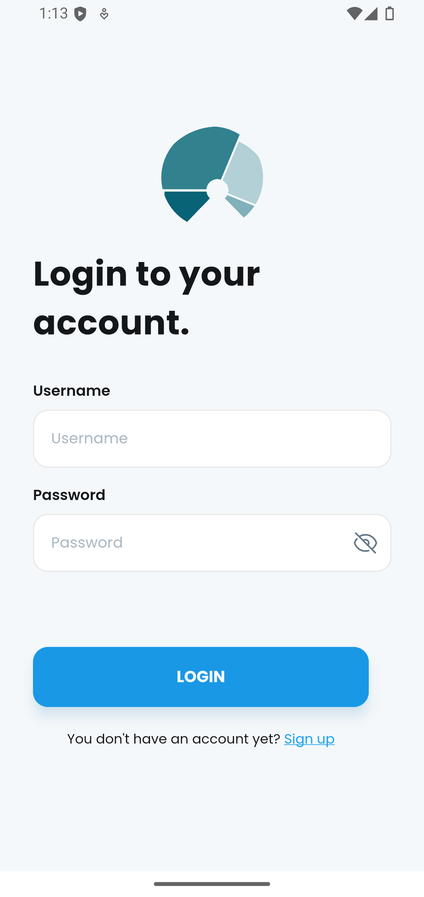
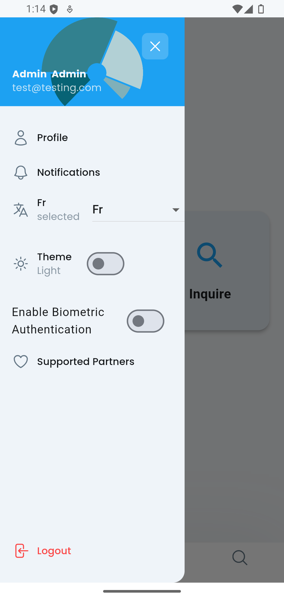
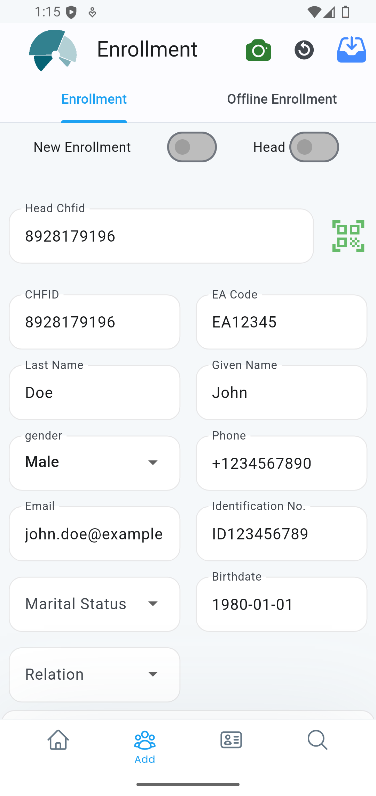
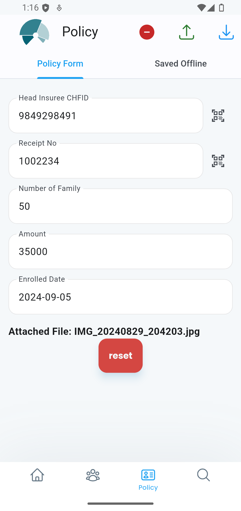
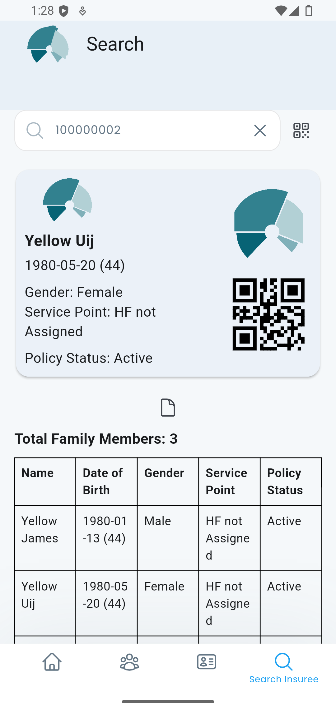
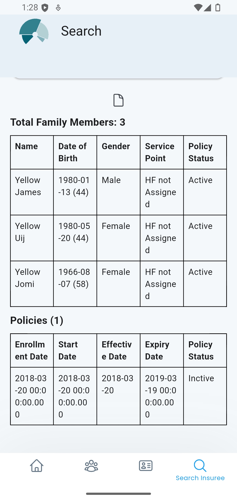

<!-- PROJECT LOGO -->
<br />
<div align="center">
  <a href="">
    
  </a>
<h1 align="center">openIMIS Enrollment </h1>

  <p align="center">
    Application to enroll, update policy and search insuree(s)
    <br />
    <a https://github.com/sunilparajuli/openimis-enrollment/">View Demo</a>
    ·
    <a href="https://github.com/sunilparajuli/openimis-enrollment/issues">Report Bug</a>
    ·
    <a href="https://github.com/sunilparajuli/openimis-enrollment/issues">Request Feature</a>
  </p>
</div>


<!-- ABOUT THE PROJECT -->

## About The Project

Helps Enrollment Officers / Insuree to view information, enroll new contributors in system

- search for insuree chfid.
- Enroll family & insurees.
- Offline features to be submitted when coverage is on for rural areas.
- Backend as openIMIS module.
- The app is built with Flutter and Dart, MVC architecture with GetX state management.

It's MVP (Minimum Viable Product) and it's still under development.

### Built With

It's built with the following technologies:

* [![Flutter][Flutter]][Flutter-url]
* [![Dart][Dart]][Dart-url]
* [![Dio][Dio]][Dio-url]
* [![GetX][GetX]][GetX-url]
* [![Get Storage][Get Storage]][Get Storage-url]
* [![Get It][Get It]][Get It-url]
* [![Google Fonts][Google Fonts]][Google Fonts-url]
* [![Hero Icons][Hero Icons]][Hero Icons-url]
* [![Lottie][Lottie]][Lottie-url]
* [![Freezed][Freezed]][Freezed-url]
* [![Url Launcher][Url Launcher]][Url Launcher-url]
* [![Intl][Intl]][Intl-url]

### Screenshots

  <a href="https://github.com/devsadeq/JobsFlutterApp">
    
   
   
   
   
   
    
   
  </a>


<!-- GETTING STARTED -->

## Getting Started

_To get a local copy up and running follow these simple steps._

### Prerequisites

_Make sure you have Flutter installed on your machine. If not, follow the instructions on the
official Flutter website._

### Installation

1. Download or clone this repo by using the link below:

   ```sh
   git clone https://github.com/sunilparajuli/openimis-enrollment
   ```
2. Go to project root and execute the following command in console to get the required dependencies:

   ```sh
   flutter pub get 
   ```

<!-- CONTACT -->

## Contact

Sunil Parajuli - sunilparajuli2002@gmail.com , sunil.parajuli@tinker.com.np

LinkedIn: [https://www.linkedin.com/in/sunil-parajuli-a49102b7/)


## Feature Remaining:

- Insuree registration (self, using mobile number) -> can see claim , policy , claim lists, notification
- Push Notifications
- Extension of Security feature (RSA) implementation through backend & frontend
  

<!-- MARKDOWN LINKS & IMAGES -->
<!-- https://www.markdownguide.org/basic-syntax/#reference-style-links -->


[Dart-url]: https://dart.dev/

[Google Fonts]: https://img.shields.io/badge/Google_Fonts-4285F4?style=for-the-badge&logo=google-fonts&logoColor=white

[Google Fonts-url]: https://fonts.google.com/

[Lottie]: https://img.shields.io/badge/Lottie-FF6C37?style=for-the-badge&logo=lottie&logoColor=white

[Lottie-url]: https://lottiefiles.com/

[Dio]: https://img.shields.io/badge/Dio-0175C2?style=for-the-badge&logo=dio&logoColor=white

[Dio-url]: https://pub.dev/packages/dio

[GetX]: https://img.shields.io/badge/Get-0175C2?style=for-the-badge&logo=get&logoColor=white

[GetX-url]: https://pub.dev/packages/get

[Get Storage]: https://img.shields.io/badge/Get_Storage-0175C2?style=for-the-badge&logo=getstorage&logoColor=white

[Get Storage-url]: https://pub.dev/packages/get_storage

[Flutter Screenutil]: https://img.shields.io/badge/Flutter_Screenutil-0175C2?style=for-the-badge&logo=flutterscreenutil&logoColor=white

[Flutter Screenutil-url]: https://pub.dev/packages/flutter_screenutil

[Get It]: https://img.shields.io/badge/Get_It-0175C2?style=for-the-badge&logo=getit&logoColor=white

[Get It-url]: https://pub.dev/packages/get_it

[Freezed]: https://img.shields.io/badge/Freezed-0175C2?style=for-the-badge&logo=freezed&logoColor=white

[Freezed-url]: https://pub.dev/packages/freezed

[Intl]: https://img.shields.io/badge/Intl-0175C2?style=for-the-badge&logo=intl&logoColor=white

[Intl-url]: https://pub.dev/packages/intl

[Url Launcher]: https://img.shields.io/badge/Url_Launcher-0175C2?style=for-the-badge&logo=url_launcher&logoColor=white

[Url Launcher-url]: https://pub.dev/packages/url_launcher

[Hero Icons]: https://img.shields.io/badge/Hero_Icons-0175C2?style=for-the-badge&logo=heroicons&logoColor=white

[Hero Icons-url]: https://heroicons.com/
